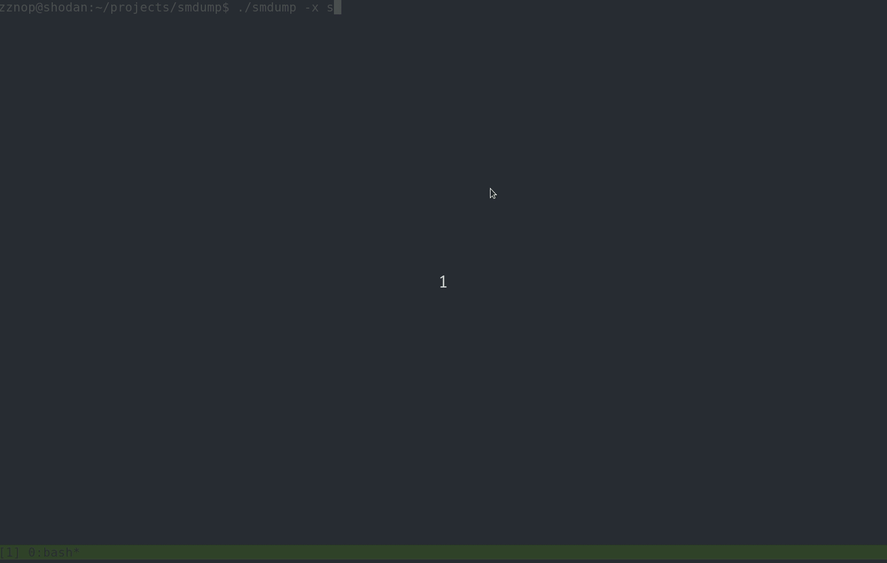

# smd-utils

# Description

SEGA Megadrive Utilities (smd-utils) is a collection of binutils-like tools to
add in binary analysis of SEGA Megadrive/Genesis game ROMs.

# List of Tools

* **smdump** - objdump-like tool for disassembling SMD ROMs and displaying
header information

More soon..

# Dependencies

Someday I'll make a setup.py. For now, `pip install capstone`
